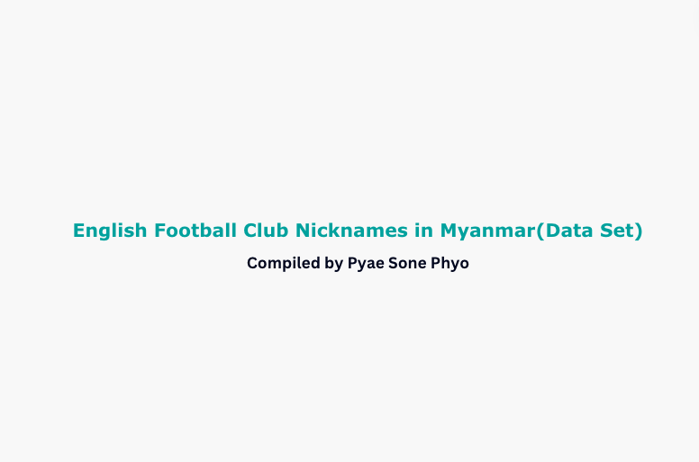

# English Football Clubs Nicknames Dataset

## Overview
Welcome to the English Football Clubs Nicknames dataset! This dataset provides information about the nicknames associated with various English football clubs burmese people used to called.

## Contents
- **Data File:** 
  - `english_football_clubs_nicknames.xlsx`: The main dataset file containing the list of English football clubs and their respective nicknames.

## Columns Description
- `Club`: The name of the English football club.
- `Nickname(s)`: The nickname(s) associated with the club.

## Usage
- This dataset can be utilized for various purposes including:
  - Exploring the cultural aspects of English football clubs.
  - Analyzing the diversity of club identities through their nicknames.
  - Conducting research on fan culture and club branding.

## Acknowledgements
- The data in this dataset has been compiled by Pyae Sone Phyo.
- Data sources include myanmar fooball fan communities and fan pages.
## License
- This dataset is provided under the [Creative Commons Attribution 4.0 International License](https://creativecommons.org/licenses/by/4.0/). You are free to share and adapt the data for any purpose, even commercially, as long as proper attribution is provided.

## Contact
- Creator: Pyae Sone Phyo
- Email: pyaesonephyo9602@gmail.com

- Thank you for using the English Football Clubs Nicknames dataset. We hope it proves to be a valuable resource for your projects and analyses!
